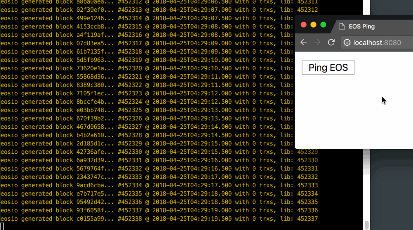
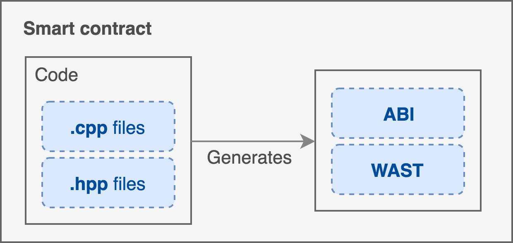

# Ping with EOS and React



With all the excitement around EOS, an area that remains challenging for most developers looking to become involved is getting started with smart contracts. There are generally two hurdles for new developers to overcome: getting your tooling setup, and knowing how to write the smart contract itself.

EOS smart contracts are written in C++ and compile into Web Assembly. [Dan Larimer](https://steemit.com/eos/@dan/eos-example-exchange-contract-and-benefits-of-c) chose C++ to take advantage of its type and templating system which makes for safer contracts, and adds that because smart-contracts have short runtimes, most of the memory concerns fall away.

## Setting up
Part of the challenge in working with EOS is setting up the local blockchain to work against. Luckily, EOS offers some facilities for [setting up your local EOS environment](https://github.com/EOSIO/eos/wiki/Local-Environment#getting-the-code). For this guide, we’ll be using `EOSIO Dawn 3.0`.

A summary of that guide can be condensed into a few key commands:
```bash
$ git clone https://github.com/EOSIO/eos --recursive
$ cd eos
$ ./eosio_build.sh
$ cd build && make install
$ cd programs/nodeos
$ ./nodeos -e -p eosio --plugin eosio::wallet_api_plugin --plugin eosio::chain_api_plugin --plugin eosio::account_history_api_plugin --access-control-allow-origin=*
```

The installation will take some time, but is straightforward. Once you have a local EOS blockchain up and running locally, you’re ready to start. Throughout the guide, we’ll reference some utilities like  `cleos` and `eosiocpp`. You can find these inside your `eos/programs` folder.

## Building a ping smart contract
For this tutorial we’ll create and deploy the “Hello World” of distributed systems: ping/pong. For the uninitiated, we will send the server a  “ping” command, and it will respond with “pong”. A smart contract is composed of a few things: C++ code, an ABI (Application Binary Interface), and a WAST (Web Assembly Text file) based on the C++ code. Here’s what that looks like:



### Implementing ping
After we’ve got our tooling environment setup, let’s get into the contract! To write the ping smart contract, we only need a contract that implements one action: `ping`. All this method needs to do is print “Pong” in return. 

Create a folder called `ping` inside `contracts`, and a file `ping/ping.cpp`:
```c++
#include <eosiolib/eosio.hpp>
#include <eosiolib/print.hpp>

class ping_contract : public eosio::contract {
  public:
      using eosio::contract::contract;
      void ping(account_name receiver) {
         eosio::print("Pong");
      }
};

EOSIO_ABI( ping_contract, (ping) )
```

The idea here is to have a simple and small example you can test with to become more familiar with the moving pieces. Let’s break down what’s going on here:
1. We include some definitions to write our contract.
2. We create a new contract class that inherits from the [eos::contract](https://github.com/EOSIO/eos/blob/8425ff88a7f712c7df46b979de0e6e7de512f569/contracts/eosiolib/contract.hpp).
3. We create a method that prints “Pong”
4. The last line is a [macro that was recently added](https://github.com/EOSIO/eos/pull/2051), it saves us the effort of maintaining our own hand-written ABIs by generating one based on the methods we pass into the second parameter.

### Building your contract
The EOS block producers don’t run C++ code when executing smart contracts, they expect web-assembly. EOS offers a tool called `eosiocpp` for converting your C++ code to Web Assembly Text. Let’s do that now with 
`eosiocpp -o ping.wast ping.cpp`. This will compilation step will generate some warnings, but we can disregard those for now.

Next, we need the Application Binary Interface. Essentially, the API for your smart contract that will describe the methods and their corresponding signatures. Since we added the `EOSIO_ABI` macro at the end of our file, instead of writing one by hand, we can simply generate it with: `eosiocpp -g ping.abi ping.cpp`

At this point, your folder should look like:
```
├── ping.abi
├── ping.cpp
└── ping.wast
```

## Deploying to your local network
Now that we have all the materials necessary for our smart contract, let’s get to deploying it. Make sure you’ve got a wallet created `cleos wallet create` and ensure it’s unlocked by running `cleos wallet unlock` and typing your wallet password if prompted. We’ll deploy our smart contract under another account.

For this, we’ll need to create a new key-pair, let's do that by running: `cleos create key`. This will generate a random public and private key for you. Throughout the rest of the tutorial, be sure to replace any indications of [public_key]/[private_key] with the values you've just received.

Import the private key to your current unlocked account wallet: `cleos wallet import [private_key]`
Set up an account for the contract with the public key: `cleos create account eosio ping.ctr [owner_key: public_key] [active_key: public_key]`
- Link the contract with your newly created account `cleos set contract ping.ctr ../ping -p ping.ctr`

## Interacting with ping
Once your new contract is deployed, it’s time to interact with it! Let's create a tester account with the same keys to run the transaction: `cleos create account eosio tester [public_key] [public_key]`

Now we can test it out on the command line:
```bash
$ cleos push action ping.ctr ping '["tester"]' -p tester
executed transaction: e89ebeaad8f3623e42d966f62d4d0adbf6a7412b6bb4d7be61f04a22d3cd485e  232 bytes  102400 cycles
#  ping.ctr <= ping.ctr::ping           {"account":"tester"}
>> Received ping
```

It works!

This is exciting for us programmers, but most of your users won’t setup their command line to interact with your smart contract. So let’s bring this interaction to an interface they’re more familiar with: their browser. 

### Interacting through the browser
To interact with EOS from the frontend, we’ll use  [EOS.js](https://github.com/EOSIO/eosjs). Since we’re using dawn3 on our EOS backed, we need to make sure to use the `dawn3` branch when installing: `npm install eosjs@dawn3`.

We start off by configuring:
```javascript
Eos = require('eosjs')

eos = EOS.Localnet({
  keyProvider: ['{replace_with_your_private_key}'],
  httpEndpoint: 'http://127.0.0.1:8888'
})
```

Once configured, we have to specify a few details:
```javascript
eos.contract('ping.ctr').then((contract) => {
  contract.ping("tester", { authorization: ['tester'] }).then((res) => {
    console.log(res)
  })
})
```

Notice `ping.ctr`, which matches the name of the contract we deployed earlier. Once we fetch the contract interface (or ABI) we can interact with it as though it were native Javascript. The contract returns a promise with the transaction details included in the resolve function. This is the core idea of interacting with our ping smart contract from the frontend. 

To see this in a larger context with a working example, check out the [frontend code in this repository](https://github.com/tylerdiaz/ping-eos/tree/master/frontend).
